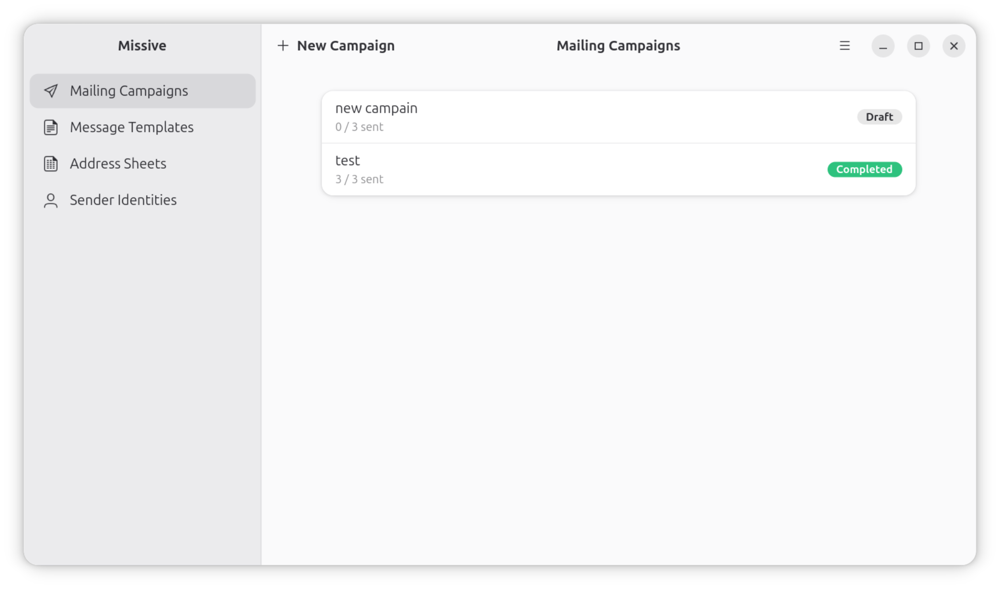

# Missive

Run personalized email campaigns by **mail merge over SMTP** — a GNOME desktop
app written in Vala with GTK 4 and libadwaita.

Missive manages several sender identities, recipient address sheets (CSV),
message templates and campaigns, and sends one personalized email per
recipient, one at a time, at a pace you choose — through **your own SMTP
server**. No telemetry, no third-party services.



## Features

- **Sender identities** with SMTP host/port/encryption and a live "Verify
  Login" connection test. Passwords are stored in the system keyring, never on
  disk.
- **Address sheets** imported from CSV (RFC 4180: quoting, embedded
  commas/newlines, UTF-8), stored locally.
- **Message templates** with a rich-text editor (bold/italic/underline, links,
  bulleted/numbered lists), an HTML-source view and a live preview. Insert
  `{field}` placeholders straight from a sheet's columns.
- **Campaigns** that snapshot the template and recipient list at creation, so
  later edits never change a campaign in flight.
- **Send engine** with a full lifecycle — run, pause, stop, continue, retry
  failed — per-recipient status saved after every message, so a campaign
  resumes exactly where it stopped after a quit or crash.
- **Send test** to a configurable test address before a real run.
- Localized in English, French, German, Italian, Spanish and Dutch.

## Install (Flatpak)

Missive builds and runs as a sandboxed Flatpak against the GNOME 49 runtime.

**Prerequisites** — `flatpak` and `flatpak-builder`, plus the GNOME 49 runtime
and SDK:

```sh
flatpak install flathub org.gnome.Platform//49 org.gnome.Sdk//49
```

**Build and install** (from the project root):

```sh
flatpak-builder --user --install --force-clean build-dir build-aux/fr.bellamy.missive.json
```

**Run:**

```sh
flatpak run fr.bellamy.missive
```

To see the interface in another language, install the extra locales once:

```sh
flatpak config --user --set extra-languages "en;fr;de;it;es;nl"
flatpak update --user fr.bellamy.missive.Locale
```

then pick a language in **☰ → Preferences → Language** (takes effect after
restart).

## Getting started

1. **Sender Identities** → *New*: enter your SMTP server and login.
2. **Address Sheets** → *Import*: choose a CSV and the column holding the email
   addresses.
3. **Message Templates** → *New*: write the subject and body, and use *Insert
   Fields From* to drop `{tokens}` that are filled per recipient.
4. **Mailing Campaigns** → *New Campaign*: pick the identity, sheet, template
   and recipient column.
5. Open the campaign, **Send Test**, then **Run**.

A short how-to is also available in the app under **☰ → Help**.

## Building without Flatpak

The app targets the GNOME 49 stack. With the matching development packages
installed (GTK 4, libadwaita-1, sqlite3, libsecret-1, json-glib-1.0,
webkitgtk-6.0, GMime 3, libcurl, plus Vala, Meson, Ninja and
blueprint-compiler):

```sh
meson setup build
ninja -C build
```

Note that GMime 3 is bundled by the Flatpak manifest because it is not part of
the GNOME runtime; a non-Flatpak build expects it to be available on the system.

## License

[GPL-3.0-or-later](LICENSE).
